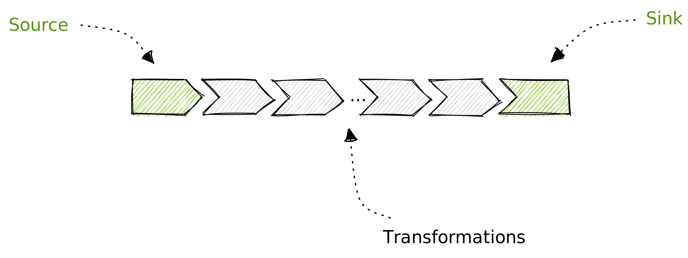
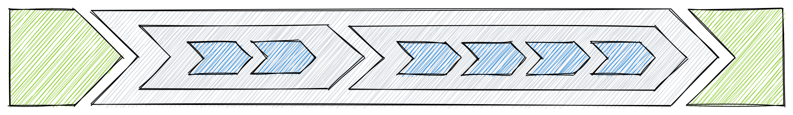

# Pipelines

The VAST language centers around one principle: **dataflow pipelines**.

A pipeline is chain of [operators](operators) that represents a flow of data.
Operators can produce, transform, or consume data. Think of it as UNIX pipes or
Powershell commands where output from one command is input to the next:


VAST distinguishes three types of operators:

1. **Source**: generates new data
2. **Transformation**: modifies data
3. **Sink**: consumes data

A pipeline consists of one source, one sink, and zero or more transformations.
The diagram below illustrates the operator chaining:



If a pipeline would not have a source and sink, it would "leak" data. We call
pipelines that have both a source and sink a **closed pipeline**. VAST can only
execute closed pipelines. A pipeline that solely consists of a chain
transformations is an **open pipeline**. You can use open pipelines as building
blocks to build nested pipelines:



Pipelines have a *logical* and *physical* representation. Users only specify the
logical form, whereas the VAST defines the mapping to a physical representation
that potentially looks differently. This distinction allows VAST to
transparently optimize the execution. For example, filter predicates may be
"pushed down" to reduce the amount of data that flows through a pipeline. Such
optimizations are common practice in declarative query languages.

## Syntax

VAST comes with its own language to define pipelines, geared towards working
with richly typed, structured event data across multiple schemas. There exist
numerous dataflow languages out there, and drew inspiration from others to
achieve:

- the *familiarity* of [splunk](https://splunk.com)
- the *capability* of [jq](https://stedolan.github.io/jq/)
- the *elegance* of [Zed](https://zed.brimdata.io/)
- the *fluidity* of [Nu](https://www.nushell.sh/)
- the *ambition* of [PRQL](https://prql-lang.org/)
- the *ease* of [Kusto](https://github.com/microsoft/Kusto-Query-Language)

More generally, we put a lot of emphasis on the following guidelines when
designing the language:

1. Use natural language keywords where possible
2. Lean on operator names that are familiar to Unix and Powershell users
3. Avoid gratuitous syntax elements like brackets, braces, quotes, or
   punctionations.
4. Exploit symmetres for an intuitive learning experience, e.g., `from` and
   `to`, `read` and `write`.

### Pipeline Example

How does the syntax of a concrete VAST pipeline look? Let's take the following
example:


Here is how you write this pipeline in the VAST language:

```cpp
from vast
| where #type == "zeek.weird" && note == "SSL::Invalid_Server_Cert"
| summarize count(num) by id.resp_h
| sort
| head 20
| write json to stdout
```

The pipeline performs the following steps:

1. Get data from VAST
2. Filters out a subset of events
3. Aggregate them by destination IP
4. Sort by frequency
5. Take the top-20 items
6. Write the output as JSON to standard output

When [executing a pipeline](/docs/use/export) with the `vast` binary via the
`export` command, source and sink operators are implicit. This means you would
execute the pipeline as follows:

```bash
vast export json 'where ... | ... | head 20'
```

### Expressions

VAST [expressions](expressions) are search expressions to describe the desired
working set, usually at the beginning of an interactive data exploration. An
expression consists of predicates chained together by *connectives*, such as a
conjunction (logical AND), a disjunction (logical OR), and a negation (logical
NOT). The expressiveness is equivalent to [boolean
algebra](https://en.wikipedia.org/wiki/Boolean_algebra) and its laws.

Expression occur predominatly as argument to the [where](operators/where.md)
operator to filter the dataflow. Other expression elements, such as
[extractors](expressions#extractors), also occur in other operators.

Historically, the VAST language only supported providing expressions. But the
strong demand for reshaping and analytic workloads made the language evolve to
include dataflow semantics.

## Language Frontends

If you do not like the syntax of the VAST language and prefer to bring your own
language to the data, then you can write a [frontend](frontends) that transpiles
user input into the VAST language.

For example, we provide a [Sigma](frontends/sigma) frontend that transpiles a
YAML detection rule into VAST [expression](expressions). In fact, the VAST
language itself is a language frontend.

In future, we aim for providing frontends for SQL and other detection languages.
Please [chat with us](/discord) if you have ideas about concrete languages VAST
should support.
