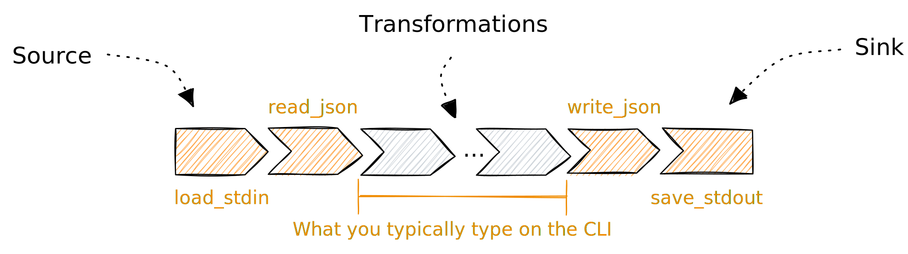

# Run pipelines

You can run a [pipeline](../../pipelines/README.md) in the
[platform](https://app.tenzir.com) or on the command line using the `tenzir`
binary.

## In the platform

Run a pipeline by writing typing it in the editor and hitting the *Run* button.

The following invariants apply:

1. You must start with an input operator
2. The browser is always the output operator

The diagram below illustrates these mechanics:


For example, write [`version`](../../tql2/operators/version.md) and click *Run*
to see a single event arrive.

## On the command line

On the command line, run `tenzir <pipeline>` where `<pipeline>` is the
definition of the pipeline.

If the pipeline expects events as its input, an implicit `load_stdin |
read_json` will be prepended. If it expects bytes instead, only `load_stdin` is
prepended. Likewise, if the pipeline outputs events, an implicit `write_json |
save_stdout` will be appended. If it outputs bytes instead, only `save_stdout`
is appended.

The diagram below illustrates these mechanics:



For example, run [`tenzir 'version | drop
dependencies'`](../../tql2/operators/version.md) to see a single event in the
terminal:

```tql
{
  version: "4.22.1+g324214e6de",
  tag: "g324214e6de",
  major: 4,
  minor: 22,
  patch: 1,
  features: [],
  build: {
    type: "Release",
    tree_hash: "c4c37acb5f9dc1ce3806f40bbde17a08",
    assertions: false,
    sanitizers: {
      address: false,
      undefined_behavior: false,
    },
  },
}
```

You could also render the output differently by choosing a different
[format](../../formats.md):

```bash
tenzir 'version | drop dependencies | write_csv'
tenzir 'version | drop dependencies | write_ssv'
tenzir 'version | drop dependencies | write_parquet | save_file "version.parquet'
```

Instead of passing the pipeline description to the `tenzir` executable, you can
also load the definition from a file via `-f`:

```bash
tenzir -f pipeline.tql
```

This will interpret the file contents as pipeline and run it.

## As Code

In addition to running pipelines interactively, you can also deploy *pipelines as
code (PaC)*. This infrastructure-as-code-like method differs from the app-based
deployment in two ways:

1. Pipelines deployed as code always start with the Tenzir node, ensuring
   continuous operation.
2. To safeguard them, deletion via the user interface is disallowed.

Here's a an example of deploying a pipeline through your configuration:

```yaml {0} title="<prefix>/etc/tenzir/tenzir.yaml"
tenzir:
  pipelines:
    # A unique identifier for the pipeline that's used for metrics, diagnostics,
    # and API calls interacting with the pipeline.
    suricata-over-tcp:
      # An optional user-facing name for the pipeline. Defaults to the id.
      name: Onboard Suricata from TCP
      # An optional user-facing description of the pipeline.
      description: |
        Onboards Suricata EVE JSON from TCP port 34343.
      # The definition of the pipeline. Configured pipelines that fail to start
      # cause the node to fail to start.
      definition: |
        load_tcp "0.0.0.0:34343"
        read_suricata
        publish "suricata"
      # Pipelines that encounter an error stop running and show an error state.
      # This option causes pipelines to automatically restart when they
      # encounter an error instead. The first restart happens immediately, and
      # subsequent restarts after the configured delay, defaulting to 1 minute.
      # The following values are valid for this option:
      # - Omit the option, or set it to null or false to disable.
      # - Set the option to true to enable with the default delay of 1 minute.
      # - Set the option to a valid duration to enable with a custom delay.
      restart-on-error: 1 minute
      # Add a list of labels that are shown in the pipeline overview page at
      # app.tenzir.com.
      labels:
        - Suricata
        - Onboarding
      # Disable the pipeline.
      disabled: false
      # Pipelines that are unstoppable will run automatically and indefinitely.
      # They are not able to pause or stop.
      # If they do complete, they will end up in a failed state.
      # If `restart-on-error` is enabled, they will restart after the specified
      # duration.
      unstoppable: true
```
