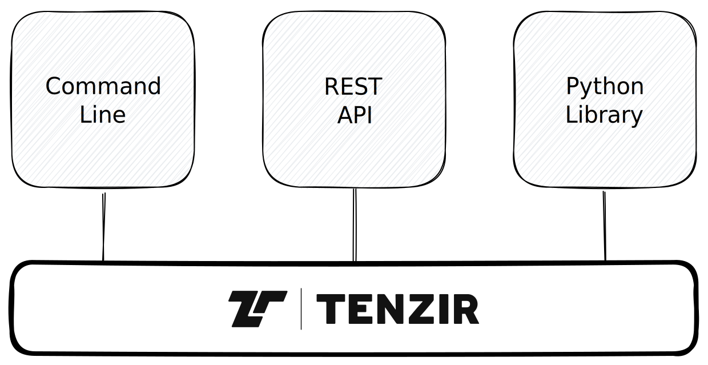

# Use

This section describes VAST from a **user perspective**. There exist three
different user interfaces today:

1. Command line interface (CLI)
2. REST API
3. Python library

In the following, we discuss what you can do with VAST. We use the CLI to
demonstrate most use cases.

import DocCardList from '@theme/DocCardList';

<DocCardList />
