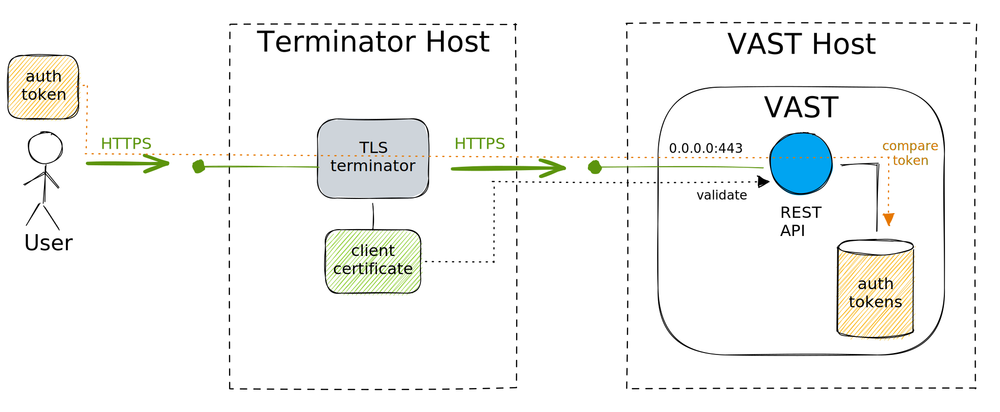

# REST API

VAST provides a REST API to interact with a server node. The `web`
[plugin](../../../develop/architecture/plugins.md) implements the API as a
dedicated component that can run in multiple ways.

:::tip API Documentation
At [https://vast.io/api](/api) you can find documentation of the API routes and
an [OpenAPI Specification](https://spec.openapis.org/oas/latest.html).

Please note that we consider v0 still experimental and therefore do not provide
stability guarantees.
:::

## Deployment Modes

There exist two ways to run the `web` plugin: either as a separate process or
embedded inside a VAST server node:


Running the REST API as dedicated process gives you more flexibility with
respect to deployment, fault isolation, and scaling. An embedded setup offers
higher throughput and lower latency between the REST API and the other VAST
components.

To run the REST API as dedicated process, use the `web server` command:

```bash
vast web server --certfile=/path/to/server.certificate --keyfile=/path/to/private.key
```

To run the server within the main VAST process, use a `start` command:

```bash
vast start --commands="web server [...]"
```

The server will only accept TLS requests by default. To allow clients to connect
successfully, you need to pass a valid certificate and corresponding private key
with the `--certfile` and `--keyfile` arguments.

## Authentication

Clients must authenticate all requests with a valid token. The token is a short
string that clients put in the `X-VAST-Token` request header. You can generate a
valid token on the command line:

```bash
vast web generate-token
```

For local testing and development, generating suitable certificates and tokens
can be a hassle. For this scenario, you can start the server in [developer
mode](#developer-mode) where it accepts plain HTTP connections are does not
perform token authentication.

## TLS Modes

There exist four modes to start the REST API, each of which suits a slightly
different use case.

### Developer Mode

The developer mode bypasses encryption and authentication token verification.


Pass `--mode=dev` to start the REST API in developer mode:

```bash
vast web server --mode=dev
```

### Server Mode

The server mode reflects the "traditional" mode of operation where VAST binds to
a network interface. This mode only accepts HTTPS connections and requires a
valid authentication token for every request. This is the default mode of
operation.


Pass `--mode=server` to start the REST API in server mode:

```bash
vast web server --mode=server
```

### Upstream TLS Mode

The upstream TLS mode is suitable when VAST sits upstream of a separate
TLS terminator that is running on the same machine. This kind of setup
is commonly encountered when running nginx as a reverse proxy.


VAST only listens on localhost addresses, accepts plain HTTP but still
checks authentication tokens.

Pass `--mode=upstream` to start the REST API in server mode:

```bash
vast web server --mode=upstream
```

### Mutual TLS Mode

The mutual TLS mode is suitable when VAST sits upstream of a separate TLS
terminator that may be running on a different machine. This setup is commonly
encountered when running nginx as a load balancer. VAST would typically be
configured to use a self-signed certificate in this setup.

VAST only accepts HTTPS requests, requires TLS client certificates for incoming
connections, and requires valid authentication tokens for any authenticated
endpoints.



Pass `--mode=mtls` to start the REST API in server mode:

```bash
vast web server --mode=mtls
```

## Scaling

There are two ways to scale the REST API, shall it be the bottleneck. You can
either spawn more REST API actors within VAST and expose them at different
ports, or you can spawn more dedicated web server processes:


We do not anticipate that the web frontend will be on the critical path, since
the web server itself performs very little work. But we get this form of scaling
"for free" as a byproduct of VAST's [actor model
architecture](../../../develop/architecture/actor-model.md), which is why we
mentioned it here.
