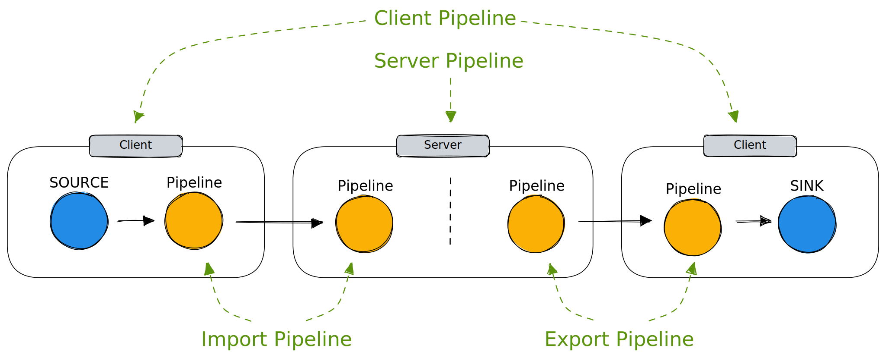

# Transform

VAST has powerful features for transforming [data in
motion](#modify-data-in-motion) and [data at rest](#modify-data-at-rest). Both
aspects rely on [pipelines](/docs/understand/query-language/pipelines) as
building block.

## Modify data in motion

VAST supports *import* and *export* pipelines. The former apply to new data
ingested into the system, the latter apply to the results of a VAST query. Both
import and export pipelines can run in the server or client process. For
imports, the client is the source generating the data, for exports the client is
the sink receiving the exported data.



The flexible combination of location and type of pipeline type enables multiple
use cases:

Location | Type   | Use case        | Example
---------|--------|-----------------|---------- -------------------------------
Client   | Import | Enrichment      | Add community ID to flow telemetry
Server   | Import | Compliance      | Anonymize PII data
Client   | Export | Post-processing | Compute expensive function (e.g., string entropy)
Server   | Export | Access control  | Remove sensitive fields

Deploying a pipeline involves involves two separate configuration steps:

1. Define the pipeline
2. Trigger the pipeline

The trigger determines when and where a pipeline executes. Here is an example
configuration:

```yaml
vast:
  pipelines:
     example_pipeline: |
       operator1
       | operator2
  pipeline-triggers:
    import:
      - pipeline: example_pipeline
        location: server
        events: [intel.ioc, zeek.conn]
```

Triggers are defined under configuration key `vast.pipeline-triggers`. The two
subkeys `import` and `export` specify the pipeline type the trigger itself is a
dictionary with three keys:

1. `pipeline`: the name one of a previously defined pipeline
2. `location`: either `server` or `client`
3. `events`: a list of event types for which the pipeline fires

The above example configures `example_pipeline` to run at on the server side
during import for the two events `intel.ioc` and `zeek.conn`.

## Modify data at rest

### Delete old data when reaching storage quota

VAST's disk-monitoring feature enables periodic deletion of events based on
utilized disk storage. To limit the disk space used by the VAST database,
configure a disk quota:

```bash
vast start --disk-quota-high=1TiB
```

Whenever VAST detects that its database directory has grown to exceed the
configured quota, it will erase the oldest data in the database. It is possible
to specify an additional `--disk-quota-low` option to define a corridor for
the disk space usage. This can be used to avoid having VAST running permanently
at the upper limit and to instad batch the deletion operations together.

The full set of available options looks like this:

```yaml
vast:
  start:
    # Triggers removal of old data when the DB dir exceeds the disk budget.
    disk-budget-high: 0K
    # When the DB dir exceeds the budget, VAST erases data until the directory size
    # falls below this value.
    disk-budget-low: 0K
    # Seconds between successive disk space checks.
    disk-budget-check-interval: 90
```

:::note
When using this method, we recommend placing the log file outside of the
database directory. It counts towards the size calculations, but cannot be
automatically deleted during a deletion cycle.
:::

### Transform old data when reaching storage quota

Instead of just deleting data periodically, VAST can also trigger **spatial
compaction** when exceeding a given disk budget. A spatial compaction cycle
transforms data until disk usage falls below the budget, e.g., by removing
columns or rows from certain events, or by deleting them entirely.

When the disk budget exceeds the configured threshold, VAST decides what data
to compact. The compaction *mode* defines how this happens. Currently, there
exists only one mode: [weighted age](#weighted-age).

This compaction mode selects all events according to a *weighted age*. To
compute the weighted age, VAST divides the actual age of an event with the
weight assigned to this event type. For example, applying a weight of 100 to an
event that is 100 days old would yield a weighted age of 1 day. This causes it
to be transformed after events that are 50 days old. Conversely, a weights less
than one results in an older weighted age, resulting in earlier consideration in
a compaction cycle.

The default weight is 1 for all event types. Here is an example configuration
that adjusts the weights:

```yaml
vast:
  plugins: [compaction]
plugins:
  compaction:
    space:
      mode: weighted-age
      interval: 6 hours
      disk-budget-high: 10TiB
      disk-budget-low:   8TiB
      weights:
        - weight: 0.1
          types: [suricata.flow]
          #pipeline: fancy_flow_compaction
        - weight: 100
          types: [suricata.alert]
          #pipeline: fancy_alert_compaction
```

The `pipeline` key for each type is optional. If present, the corresponding
pipeline processes all matching events. If absent, VAST deletes matching events.

Two additional keys are useful to fine-tune the behavior of the compaction
plugin:

1. `compaction.space.scan-binary`: an absolute path to a binary that should be
   executed to determine the current disk usage
2. `compaction.space.step-size`: adjust how many compaction candidates should be
   processed before re-checking the size of the database directory

### Transform data after exceeding a retention span

VAST triggers temporal compaction according to a set of rules that define how
to transform events after they reach a specfic age. This declarative
specification makes it easy to express fine-grained data retention policies,
which is often needed for regulatory requirements and compliance.

For each compaction cycle, VAST processes all rules and identifies what subset
of the data has become subject to transformation. To this end, each rule
defines a *minimum* age, i.e., a lower bound that must be exceeded before the
corresponding events undergo their configured pipeline.

To configure temporal compaction, provide a list of compaction rules under the
key `plugins.compaction.time` in the VAST configuration. A compaction rule
defines the minimum age using key `after`, the pipeline to apply with the
key `pipeline`, the scope in terms of schema using the key `types`, and a name
to uniquely refer to the rule. Omitting the `types` key causes temporal
compaction rules to be applied to all schemas.

By default, a compaction rule consumes its input, i.e. it erases the original
events from the database and replaces them with the transformed events. The
`preserve-input` option can be specified on a temporal compaction rule to override
this behavior and to keep the input partitions available.

:::note
VAST applies each rule only once per partition and stores the applied rule name
within the partition meta data. If you rename a rule in the configuration and
reload a new compaction configuration, already compacted partitions will undergo
another round of compaction.
:::

The pipelines referenced in the compaction configuration must be defined in the
VAST configuration.

```yaml
vast:
  plugins: [compaction]
  pipelines:
    anonymize_urls: |
      replace net.url="xxx"
    aggregate_flows: |
       summarize 
         pkts_toserver=sum(flow.pkts_toserver),
         pkts_toclient=sum(flow.pkts_toclient),
         bytes_toserver=sum(flow.bytes_toserver),
         bytes_toclient=sum(flow.bytes_toclient),
         start=min(flow.start),
         end=max(flow.end)
       by
         timestamp,
         src_ip,
         dest_ip
       resolution
         10 mins
plugins:
  compaction:
    time:
      # How often to check the `after` condition below.
      interval: 1 day
      rules:
        - after: 2 days
          name: uri_scrubbing
          pipeline: anonymize_urls
          types:
            - zeek.http
            - suricata.http
        - after: 7 days
          name: flow_reduction
          pipeline: aggregate_flows
          keep: true
          types:
            - suricata.flow
```

### Trigger a compaction manually

You can also interact with the compaction plugin on the command line, through
the `compaction` subcommand. Use the `list` subcommand to show all configured
compaction rules:

```bash
vast compaction list
```

You can then trigger a compaction manually with the `run` sub-command:

```bash
vast compaction run <rule>
```

:::note
The `compaction` plugin needs to be loaded both by the client and the server process to
use the `vast compaction` subcommand.
:::

For an overview of the current status of the compaction plugin, you can use the `vast status` subcommand:

```bash
vast status | jq .compaction
```
