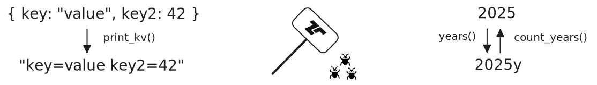

[Tenzir Node v4.29][github-release] introduces new functions for printing values as strings,
complementing v4.28's parsing functions.

[github-release]: https://github.com/tenzir/tenzir/releases/tag/v4.29.0

<!-- truncate -->

## Printing Values

With this release, we've added a bunch of new functions for printing values as
strings:

- `print_json` prints any value as its JSON representation.
- `print_yaml` prints any value as its YAML representation.
- `print_csv`, `print_ssv`, and `print_tsv` to print records as comma-, space-
  and tab-separated strings respectively.
- `print_kv` prints any value as a sequence of key-value pairs.

The new `print_*` functions behave similar to the `write_*` operators, except that
they work on values within events instead of streams of events.

In addition, we also added a new operator, `write_kv`. It is the dual for our
`read_kv` operator and enables you to write events as key-value pairs.

:::warning Pipelines May Require Updating
Along with these new functions, we decided to streamline arguments for a lot of
reading & writing operators as well as the parsing function.
Their _separator_ arguments are now all named arguments and the suffix `*_sep`
has been replaced with a proper `*_separator`. Additionally, the `unflatten`
option is now called `unflatten_separator`. For more details, see the
[changelog][changelog].
:::

## Timely Functions

We introduced new functions ranging from `years(number)` to `nanoseconds(number)`,
which allow you to convert any `number` to a `duration`. Their counterparts, such
as `count_years(duration)`, convert a `duration` back into plain count of the
respective unit.

## Fixes, Improvements & Other Small Changes

This release also contains a number of small fixes and improvements, which you
can find in the [changelog][changelog].

## Let's Connect!

Do you want to directly engage with Tenzir? Join our [Discord server][discord],
where we discuss projects and features and host our bi-weekly office hours
(every second Tuesday at 5 PM CET). Regardless of whether you just want to hang
out or have that one very specific question you just need answered, you are always
welcome!

[discord]: /discord
[changelog]: /changelog#v4290
