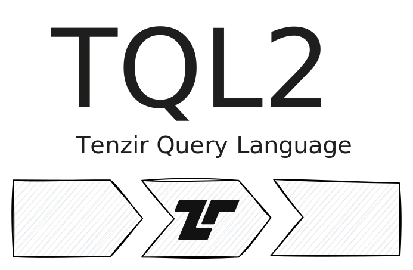

[Tenzir Node v5.0][github-release] makes TQL2 the default and only option
throughout Tenzir.



[github-release]: https://github.com/tenzir/tenzir/releases/tag/v5.0.0

<!-- truncate -->

## TQL2, Always

We first announced TQL2 with Tenzir Node v4.22 on October 18, 2024. Today—181
days later—we're announcing that going forward, TQL2 will be the default and
only Tenzir Query Language.

At Tenzir, we're all really excited about this change: Since introducing TQL2
TQL2, we've introduced [167 operators](/tql2/operators) and [153
functions](/tql2/functions), which power [32 integrations](/integrations) with
tools.

If you're already using the `tenzir.tql2` configuration option, the
`TENZIR_TQL2` environment variable, or the `--tql2` command-line option,
enabling the TQL2-only mode, then you need to do nothing when upgrading to
Tenzir Node v5.0. Congratulations: You're our favorite user, and this release
didn't actually do more for you.

If you didn't, and successfully ignored the warning for all your TQL1 pipelines,
then you will need to update your pipelines to TQL2 at this point. But don't
fret—we're [always happy to help](/discord) with this.

## Subtly Breaking Changes

Besides the obvious breaking change of TQL2 being the default, we changed the
meaning of the `1y` literal, which now resembles `365.2425d` instead of `365d`.
This aligns the duration literal with the `years()` function.

```tql
from {
  days_in_a_year: 1y.count_days(),
}
```

```tql
{days_in_a_year: 365.2425}
```

Additionally, the `if` statement now potentially returns results from its two
branches out of order, which brings a hefty performance improvement. Consider
this example:

```tql
from {x: 1}, {x: 2}
if x == 1 {
  pass
} else {
  pass
}
```

```tql
{x: 2}
{x: 1}
```

Notice that the result is out of order. The actual order between the branches is
timing-dependent, and cannot be relied upon. When re-running this pipeline, you
may also be seeing the other order.

Lasty, the formatting of `blob`-type values through the `string()` function
changed. The function now validates the blobs as UTF8, returning them as
strings, and if the validation fails returns `null` and emits a warning.

This release also contains a number of other small fixes and improvements. As
usual, you can find a full list in our [changelog][changelog].

## Let's Connect

Engage directly with Tenzir on our [Discord server][discord]! It's your hub for
discussing how to translate your remaining pipelines to TQL2, discuss further
operators and functions. The office hours take place every other Tuesday at 5 PM
CEST. Have a burning question or just want to connect with the community? Join
us—we welcome everyone!

[discord]: /discord
[changelog]: /changelog#v500
