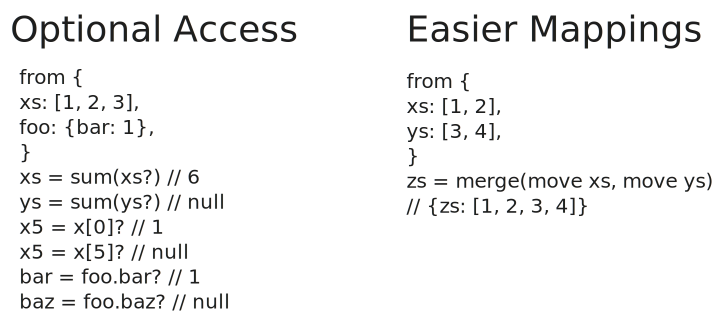

[Tenzir Node v5.1][github-release] adds more flexible ways to access and move
fields, bitwise functions, and a native integration with Google Cloud Logging.



[github-release]: https://github.com/tenzir/tenzir/releases/tag/v5.1.0

<!-- truncate -->

## Trailing Question Mark: The Preferred Way to Suppress Warnings

With Tenzir Node v5.1, we're introducing a more elegant way to access fields
without triggering warnings. While the `.?field` operator was useful, the new
trailing question mark syntax (`field?`) is more intuitive and works in more
contexts:

```tql
from {
  record: {nested: 42},
  empty_record: {}
}
value1 = record.nested?       // 42, no warning
value2 = empty_record.nested? // null, no warning
array_item = [1, 2, 3][5]?    // null, no warning for out-of-bounds
```

This new syntax is not only more readable for top-level fields (no need for
`this.?field`), but also extends to array indexing, making it a versatile
addition to TQL. The older `.?` operator is now deprecated and will be removed
in a future release.

## Moving Fields with the `move` Keyword

The new `move` keyword provides an elegant way to utilize fields and
automatically drop them after use. This reduces boilerplate code and prevents
accidentally leaving unused fields in your data.

Consider this example:

```tql
from {xs: [1, 2, 3]}
sum = sum(xs)
drop xs
```

```tql
{sum: 6}
```

Now, you can specify that the field should be moved within the assignment:

```tql
from {xs: [1, 2, 3]}
sum = sum(move xs)
```

```tql
{sum: 6}
```

Like other field accesses, `move` now also supports the trailing question mark
syntax to suppress warnings for non-existent fields:

```tql
from {foo: 1}
x = move foo?
y = move bar?
```

```tql
{
  x: 1,
  y: null,
}
```

This is particularly useful when mapping events to a standardized schema where
you want to keep track of fields you did not map yet:

```tql
from {unmapped: {…}}
mapped = {
  time: move unmapped.timestamp,
  message: move unmapped.message
}
this = {
  ...mapped,
  // Keep all fields that weren't mapped as NDJSON.
  unmapped: unmapped.print_ndjson(),
}
```

## Bitwise Operations

TQL now includes a comprehensive set of bitwise functions for numeric data
processing:

```tql
from {
  band: bit_and(5, 3),
  bor: bit_or(5, 3),
  bxor: bit_xor(5, 3),
  bnot: bit_not(5),
  shl: shift_left(5, 2),
  shr: shift_right(5, 1),
}
```

```tql
{
  band: 1,  // (0101 & 0011 = 0001)
  bor: 7,   // (0101 | 0011 = 0111)
  bxor: 6,  // (0101 ^ 0011 = 0110)
  bnot: -6, // (~0101 = 1010)
  shl: 20,  // (0101 << 2 = 10100)
  shr: 2,   // (0101 >> 1 = 0010)
}
```

Note that integral types in Tenzir have 64 bits, and we're only showing the
least significant bits for brevity.

These functions enable more sophisticated data processing, particularly useful
for working with flag values.

## Google Cloud Logging Integration

The new `to_google_cloud_logging` operator lets you send events directly to
[Google Cloud Logging](https://cloud.google.com/logging):

```tql
from {
  content: "totally not a made up log",
  timestamp: now(),
  resource: "global",
}
to_google_cloud_logging name="projects/PROJECT_ID/logs/LOG_ID",
  resource_type=resource,
  service_credentials=file_contents("/path/to/credentials.json")
```

This operator integrates seamlessly with Google Cloud's monitoring ecosystem,
allowing you to leverage Google Cloud's powerful log analysis tools.

## Easier to Use `file_contents`

The `file_contents` function now defaults to returning file contents as a string
and provides a binary mode option for non-text files:

```tql
// Default: UTF-8 string
content = file_contents("/path/to/text-file.txt")

// Binary mode for non-UTF-8 files
binary_content = file_contents("/path/to/binary-file.bin", binary=true)
```

This makes it easier to use the `file_contents` function. Previously, users
needed to write `file_contents("/path/to/file").string()` to get the file
contents as a string, which usually is what you want.

## Bug Fixes

This release also includes two important bug fixes:

- Fixed an issue where operators that interact with state inside the node and
  outside of the pipeline (like `context::update`) didn't properly work inside
  the nested pipeline of the `fork` operator and `if` statements. Note that this
  bug still exists for `every` and `cron`, for which it will be fixed in the
  next release.
- Fixed a bug in parsing TLS options for the `from_http` operator that prevented
  disabling TLS.

## Let's Connect

Want to discuss these new features or get help transitioning your pipelines?
Join our [Discord server][discord], where we host bi-weekly office hours every
Tuesday at 5 PM CEST. Whether you have specific questions or just want to
connect with the community, we welcome everyone!

[discord]: /discord
