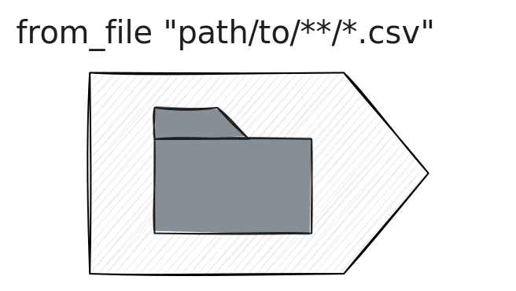

[Tenzir Node v5.2][github-release] brings our most requested feature to life,
adding the ability to watch a local filesystem directory or a blob storage
bucket for new files within a pipeline.



[github-release]: https://github.com/tenzir/tenzir/releases/tag/v5.2.0

<!-- truncate -->

## Watching Directories

The new `from_file` operator allows for reading in multiple files. It's really
simple to use, and best explained on examples. Here's how you use it to read in
a single JSON file:

```tql
from_file "/path/to/file.json"
```

The format is automatically inferred from the file extension. This also works
with compressed files. Here's how you read in a single gzip-compressed CSV file:

```tql
from_file "/path/to/file.csv.gz"
```

If the format cannot be inferred, you can specify it explicitly by specifying a
subpipeline that must return events:

```tql
from_file "/path/to/file.log" {
  read_syslog
}
```

But, you may wonder, none of this is new. What's the big deal? You've done all
this before with TQL. So consider this example:

```tql
from_file "/path/to/directory/*.csv.zst"
```

This reads in a directory of Zstd-compressed CSV files.

Just like before, you can specify the parsing pipeline explicitly. The parser
will run separately for each file:

```tql
from_file "/path/to/directory/*.log" {
  read_lines
}
```

If we use `**` we match files recursively:

```tql
from_file "/path/to/directory/**.csv"
```

Use `watch` to monitor a directory for new files:

```tql
from_file "/path/to/directory/*.csv", watch=true
```

Use `remove` to remove files after processing:

```tql
from_file "/path/to/directory/*.csv", watch=true, remove=true
```

The operator supports GCS and S3 transparently using Apache Arrow's filesystem
APIs. Just use `s3://` or `gs://` in the URL:

```tql
from_file "s3://bucket/path/to/file.csv"
```

:::info What about the old ways?
`from_file` will eventually supersede the existing `load_file`, `load_s3`, and
`load_gcs` operators. However, we're not quite there yet—the operator still
lacks support for a few options that the old ones had, like tailing files,
logging into S3 anonymously, or interacting with Unix-domain sockets.

We will add support for these features in upcoming releases, and will
subsequently deprecate the old operators.
:::

## Other Changes

This release also contains a small number of fixes and improvements. As usual,
you can find a full list in our [changelog][changelog].

## Let's Connect

Want to discuss these new features or get help transitioning your pipelines?
Join our [Discord server][discord], where we host bi-weekly office hours every
Tuesday at 5 PM CEST. Whether you have specific questions or just want to
connect with the community, we welcome everyone!

[discord]: /discord
[changelog]: /changelog#v520
