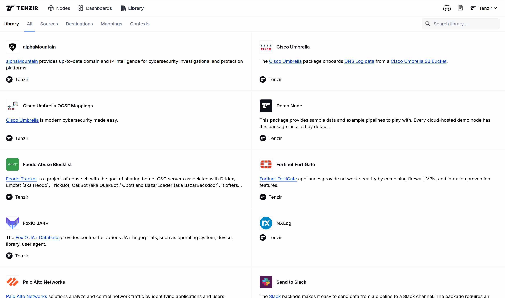

Today, we're releasing [Tenzir Platform v1.10][github-release], featuring
a restructed page layout and the option to statically define workspaces
in an on-prem environment.


[github-release]: https://github.com/tenzir/platform/releases/tag/v1.10.0

<!-- truncate -->

## Restructured Nodes Page

With this release, we reordered the page layout for better overview and
usability.

In particular, the Explorer, Pipelines and Contexts tabs are now combined into
a single, top-level Nodes tab. In addition, the Installed Packages tab from
the library also got moved into this new nodes page.


Now, all the information related to one node is concentrated in one page,
which makes it easier to get to it at a glance.

In the near future, we're planning to add a lot of additional utilites to
the nodes page, which will allow even more insights into the state of
your fleet.

The library has also been redesigned, and can now be filtered by
different subcategories:



This makes it easier to find exactly the package you're looking for.

## Static Workspaces and Ephemeral Nodes

Users of the Sovereign Edition of the Tenzir Platform now have the option to

```yaml
---
workspaces:
  static0:
    name: Tenzir
    category: Statically Configured Workspaces
    icon_url: https://storage.googleapis.com/tenzir-public-data/icons/tenzir-logo-square.svg
    auth_rules:
      - {"auth_fn": "auth_allow_all"}
```

To conveniently obtain the auth rules in the correct format, use the
new `print-auth-rule` command of the CLI. For example, to get the rule
above you can run `tenzir-platform tools print-auth-rule allow-all`.

To find the static workspace configuration file, the Tenzir Platform container
looks at the `WORKSPACE_CONFIG_FILE` environment variable.

### Ephemeral Nodes

For statically configured workspaces, it is possible to define a workspace
token. The workspace token is a shared secret, that allows every Tenzir Node
in possession of the token to connect to this workspace.

```yaml
workspaces:
  static0:
    token: wsk_e9ee76d4faf4b213745dd5c99a9be11f501d7009ded63f2d5NmDS38vXR
```

Please note that a valid workspace token must follow a specific format.
To obtain a suitable token for your workspace, use
the `tenzir-platform tools generate-workspace-token` command.

Instead of writing out the workspace token in plain text, it is also possible
to specify a file that contains the token:

```yaml
workspaces:
  static0:
    token_file: /run/secrets/workspace_token
```

A Tenzir Node can register itself at the Tenzir Platform dynamically
if it knows the workspace token:

```bash
$ cat config.yaml
tenzir:
  token: wsk_e9ee76d4faf4b213745dd5c99a9be11f501d7009ded63f2d5NmDS38vXR
  platform-control-endpoint: http://tenzir-platform.example.org:3001

$ tenzir-node --config=config.yaml
```

A node connected this way is treated as *ephemeral*, which means that it
is not permanently added to the workspace but will disappear as soon
as the connection ends.

### Static Dashboards

It is also possible to define a static set of dashboards for a workspace.
To do so, use the `dashboards` yaml key:

```yaml
workspaces:
  static0:
    dashboards:
      dashboard_1:
        name: Example Dashboard
        cells:
          - name: Dashboard 1
            definition: |
              partitions
              where not internal
              summarize events=sum(events), schema
              sort -events
            type: table
            x: 0
            y: 0
            w: 12
            h: 12
```

Dashboards are arranged in a virtual grid of width 24, so the constraint
`x+w <= 24` must be obeyed when setting dashboard coordinates.

Please note that while it is possible to update dashboards defined like this
at runtime, they will reset to their original state every time the platform
is restarted.


## Other Changes

 - The `--dry-run` option for the `tenzir-platform admin add-auth-rule` family
   of options was removed, in favor of the new `tenzir-platform tools print-auth-rule`
   set of commands.
 - [...]


## Join Us for Office Hours

Join us for our bi-weekly office hours every other Tuesday at 5 PM CET on our
[Discord server][discord]. It's a great opportunity to share your experiences,
ask questions, and help shape the future of Tenzir with your valuable feedback!

[discord]: /discord
