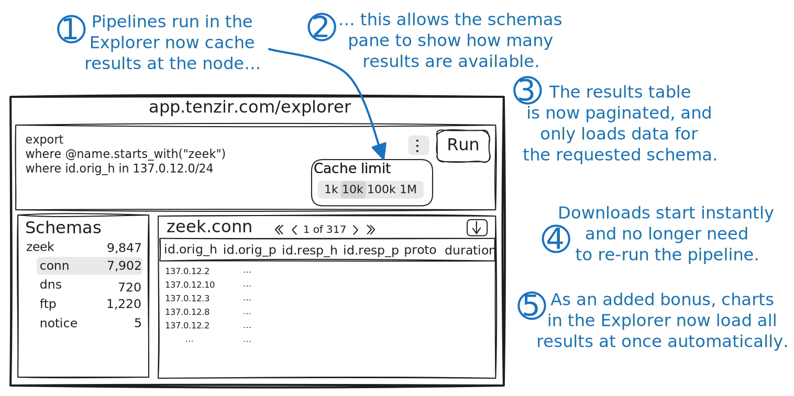

We're happy to announce [Tenzir Platform v1.9][github-release], introducing the next generation of the Tenzir Platform's Explorer.



[github-release]: https://github.com/tenzir/platform/releases/tag/v1.9.0

<!-- truncate -->

## The Idea Behind the Explorer

The Explorer has a very simple interface: Users can write a pipeline in TQL and
run it. If the pipeline has a sink, the Explorer will ask the user to deploy
their pipeline. If the pipeline does not have a sink, the results were displayed
in a data table right below the editor.

This allowed for rapid prototyping of pipelines: Start with just a source, hit
run to see results. Add a transformation, hit run again and see what's changed.
Add more transformations—rinse and repeat. Once you're satisfied with your
results, add a sink, hit run one last time and permanently deploy your pipeline.

## What Changed?

Before this release, the results table featured a "Load More" button that
allowed users to load more results as needed. The schemas pane showed a summary
of already loaded events.

Now, the schemas pane automatically shows all results that a pipeline produces,
and the results table loads events only for the selected schema. Additionally,
the results table now supports pagination, allowing users to navigate through
large datasets efficiently.

## Wait, How?

We fundamentally revisited how the Explorer fetches results from pipelines
without a user-provided sink. Previously, the Explorer would suspend the
pipeline after fetching the first batch of results, resuming it only when the
user hit the "Load More" button. Now, the Explorer loads all results into a
cache that lives at the node directly, displaying a summary of the cache in the
schemas pane and fetching individual pages from the cache as needed.

This causes additional memory usage on the node, but improves the performance
and user experience of the Explorer significantly.

## Limiting the Cache Sizes

In the Explorer, users can control how many results the cache can contain at
most. This option defaults to 10,000 events, but can be adjusted up to 1,000,000
events.

Tenzir Node v4.28 or newer support the `tenzir.cache.capacity` option that
limits the total cache usage for the node to a specified amount of memory:

```yaml
# /opt/tenzir/etc/tenzir/tenzir.yaml
tenzir:
  cache:
    # Total cache capacity in bytes for the node. Must be at least 64Mi.
    capacity: 1Gi
```

If the capacity is exceeded, the oldest cache entries are evicted from the node.

Additionally, the `tenzir.cache.lifetime` option controls how long a cache
remains valid after the pipeline has finished writing it. Afterwards, the cache
is evicted from the node. The option defaults to 10 minutes.

The options can also be specified as the `TENZIR_CACHE__CAPACITY` and
`TENZIR_CACHE__LIFETIME` environment variables, respectively.

## Faster Downloads

Previously, the "Download" button in the Explorer caused pipelines to run again.
This is no longer necessary—we can now just fetch the already cached results
again, format them as needed, which makes download practically instant.

This even works when the pipeline is still running, as downloading will now just
fetch the results cached at the time when the download was initiated.

## Join Us for Office Hours

Join us for our bi-weekly office hours every other Tuesday at 5 PM CET on our
[Discord server][discord]. It's a great opportunity to share your experiences,
ask questions, and help shape the future of Tenzir with your valuable feedback!

[discord]: /discord
