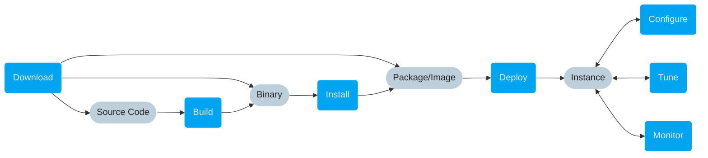

# Setup

This section describes VAST from an **operator perspective**. We cover the
different stages of the setup process that ultimately yield a running VAST
instance. You have several options to enter the setup pipeline, based on what
intermediate artifact you would like to begin with.



:::tip Quick Start
Want hands-on experience with VAST? Then continue with a quick tour below. 👇
:::

## Run VAST

To get up and running quickly, we recommend using the static binary or Docker
image:

import Tabs from '@theme/Tabs';
import TabItem from '@theme/TabItem';

<Tabs>
<TabItem value="static" label="Static Binary" default>
If you have a Linux at your fingertips, just download and extract our package
with a static binary:

```bash
mkdir /opt/vast
cd /opt/vast
wget https://github.com/tenzir/vast/releases/latest/download/vast-linux-static.tar.gz
mkdir -p /opt/vast
tar xzf vast-linux-static.tar.gz -C /opt/vast
export PATH="/opt/vast/bin:$PATH" # based on your shell, e.g., fish_add_path /opt/vast/bin
vast start
```
</TabItem>
<TabItem value="docker" label="Docker">
For a container deployment, use our official Docker image:

```bash
docker pull tenzir/vast
mkdir -p /tmp/db # persistent state
docker run -dt --name=vast --rm -p 5158:5158 -v /tmp/db:/var/lib/vast \
  tenzir/vast start
```
</TabItem>
</Tabs>

Now that you have running VAST node, you can start ingesting data.
