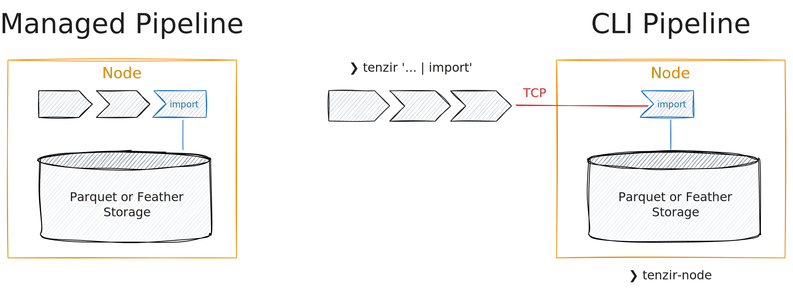

# Import into a node

Importing (or *ingesting*) data can be done by [running a
pipeline](../run-pipelines/README.md) that ends with the
[`import`](../../operators/import.md) sink operator. When managing a pipeline
through the app or the API, all pipeline operators run within the node. When
using the CLI, at least the `import` operator runs within the node.



Consider this example that takes a Zeek conn.log from our M57 dataset:

```
from file Zeek/conn.log read zeek-tsv
| select id.orig_h, id.resp_h, orig_bytes, resp_bytes
| where orig_bytes > 1 Mi
| import
```

The `import` operator requires a node execution context. To invoke the above
pipeline successfully, you need to [deploy a
node](../../setup-guides/deploy-a-node.md) first.
