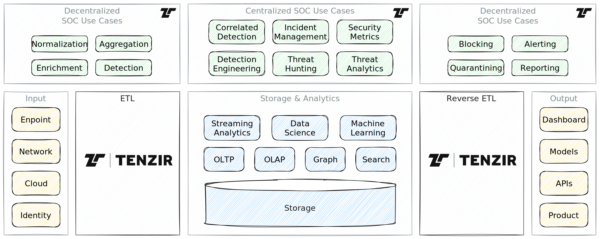

# Build a Security Data Lake

A security data lake is an intriguing value proposition. If well-architected, it
can lead to a highly cost-efficient and scalable telemetry engine. As
organizations become more comfortable storing massive amounts of sensitive data
in the public cloud, [data gravity][haleliuk23-04] increases and renders the
nearby compute services for security-centric workloads highly attractive.

However, building security data lake is a non-trivial engineering undertaking.
Most detection and response workloads rely on structured data, requiring
flexible data collection, parsing, cleaning, normalization. In addition, typical
lake interfaces are developer-facing, require SQL knowledge, and data
engineering skills—something security experts are insufficiently equipped with.

Nonetheless, those embarking on the journey to build a security data lake
ideally [know what they are doing][chuvakin22-10]. The above diagram shows an
architecture with Tenzir acting at the transport layer, as well as supporting
various detection, investigation, and response functions.

:::tip Key Takeaways
- A security data lake holds promise for cost-efficient operation and scalable
  execution of security workloads, such as threat detection, hunting,
  investigation, and response.
- Building a security lake is a complex undertaking requiring deep data
  engineering skills and security domain knowledge.
- Tenzir complements a security data lake as a highly flexible ETL layer for
  collection, transformation, and shipping of security telemetry.
- Tenzir offers numerous operators for data reshaping and normalization to
  combat the schema diversity that is at odds with the abstractions a data lake
  provides.
- Tenzir provides several building blocks for specific security use cases, such
  as YARA and Sigma executing, or retro matching of indicators, that can run
  efficiently on top of a data lake.
:::

:::info Terminology: Data Warehouse → Data Lake → Data Lakehouse
**Data warehouses** are systems primarily for structured data, excelling in
decision support and business intelligence applications, with coupled storage
and compute, but less suited for unstructured or semi-structured data. **Data
lakes** emerged as repositories for raw data in various formats, including
unstructured data; they decouple storage and compute, offering flexibility and
scalability but lack critical features like transaction support. **Data
lakehouses** combine the strengths of both, with data warehouse-like structures
and management features on top of low-cost cloud storage. They support
unstructured and structured data, diverse workloads, and maintain a decoupled
architecture while integrating key features of data warehouses. Data lake and
lakehouse are often used interchangeably in the context of open-source layers
like [Delta Lake](https://delta.io), [Iceberg](https://iceberg.apache.org), and
[Hudi](https://hudi.apache.org).
:::

## Problem: Skyrocketing security data

The telemetry data from network, endpoints, identity and cloud services keeps
growing at a relentless pace. Security teams are faced with the tough challenge
to keep up with the volume and diversity of this telemetry, as they need to
leverage it for threat detection, hunting, investigation, and response to
protect their constituency.

As organizations increasingly shift to public and private cloud offerings to
centralize storage and processing needs, the traditional model of working
with security data is under scrutiny. Building a security data lake appears
attractive to those with data engineering resources.

However, building such a lake is heavy lifting and [can fail in many
ways][chuvakin22-10]. A key challenge is the translation of the complex security
use cases to the abstractions provided by a data lake.

### Forgetting the security transport layer

Populating a security data lake requires a flexible collection, transformation,
and normalization layer to ship the data to the lake. In the above diagram, this
is the [extract-transform-load
(ETL)](https://en.wikipedia.org/wiki/Extract,_transform,_load) layer. It has its
dual on the output side, called *Reverse ETL*, to deliver the analytics results
into dashboards, create models from data, expose subsets as dynamic APIs, or
build (micro) products with the results.

A data lake has enough horse power for storage and analytics, but it does not
come with a ETL layer that lifts security data into the desired structured form
for ultra-scalable processing. Based on the scope of the lake, this can take up
a non-negligible amount of engineering. Building a composable *and* fast ETL
layer is an engineering feat on its own. The significance of this transport
layer depends on the diversity and volume of the data that should land in the
lake:

For low-volume, low-diversity settings, an ETL layer becomes insignificant.
Arguably, the concept of "lake" only makes sense when there is either
high-volume or high-diversity data or both. In these cases the transport layer
plays a crucial role in the overall architecture.

Generic ETL solutions often lack support for domain-specific types, such as IP
addresses, CIDR subnets, or URLs. Moreover, [some
workloads](execute-detections-and-analytics.md) that do not require global
correlation can cheaply run the ETL layer itself.

### Wrangling metadata and juggling tables

At their core, data lakes store data typically in columnar form, e.g., [Apache
Parquet](https://parquet.apache.org). This raw table format has several
limitations that lakehouse metadata layers attempt to fix, such as schema
evolution, time travel, partitioning, compaction, and record deletion.

A big part of a lake architecture is that storage and compute are decoupled.
When building on top of open at-rest formats, like Parquet, this allows for
choice of popular processing engines, e.g., [DuckDB](https://duckdb.org),
[Clickhouse](https://clickhouse.com), or [polars](https://pola.rs). The
decoupling benefits naturally apply to the highly integrated cloud provider
services, which can be operated more cost-efficiently when engineering resources
are scarce.

But even with a lake in place, making it *security* is non-trivial. For example,
managing schemas are still hard, despite schema evolution. What a lake provides
as abstraction for evolving schema is a monotonically increasing version. This
linear time travel feature supports querying data at a given time, but that's
not what we want for manual threat hunting and automatic retrospective
detection. Instead, we want to query *all compatible* data. In other words,
today's linear schema evolution is not suitable for typical detection and
response workloads and requires custom engineering.

## Solution: Tenzir as ETL for your Security Data Lake

Tenzir's Security Data Pipelines provide the ETL layer for your lake, taking
care of data collection, reshaping, filtering, and normalization. Tenzir
Pipelines can write into the cloud native's object storage, e.g., natively
supporting writing Parquet files into an S3 bucket.

In addition to highly scalable data ingestion, Tenzir's pipelines support
numerous building blocks for security use cases, such as high-performance
contextualization with threat intelligence or matching
[YARA](../operators/yara.md) and
[Sigma](../operators/sigma.md) rules.

The symmetry in the pipeline architecture also enables a streamlined hand-over
from detection to data-driven response, e.g., by writing pipelines that reshape
alerts into API calls for blocking user accounts. The SecDataOps principle of
data driving use cases is the connective tissue of your security data lake.

### The security ETL layer for your data lake

When you are building a security data lake to centralize storage and compute,
Tenzir's pipelines complement lake with an ETL and reverse ETL transport layer.
The data acquisition framework handles both structured and unstructured data,
offering a one-stop solution for your data movement needs:

Tenzir pipelines support unstructured data as raw chunks of bytes and structured
data as data frames backed by [Apache Arrow](https://arrow.apache.org) record
batches. We designed separate mechanisms saving/loading bytes and
parsing/printing data frames. In fact, a single pipeline can switch between
processing structured and unstructured data, making pipelines a universal
vehicle to acquire, transform, and ship data.

The high customizability via plugins supports implementing your own operators,
e.g., to deploy machine-learning models for in-band inference, perform feature
extraction to obtain word/sentence/graph/image embeddings, or simply
integrate a third-party library via C++ or Python.

In summary, Tenzir is much more than just connecting sources and sinks. You get
a vehicle for executing security-specific workloads at a location of your
choice.

### Full control over data normalization

One way to escape the schema wrangling hell is to normalize your telemetry,
coercing the data to a specific schema. Tenzir offers operators across the
*entire* spectrum of normalization:

The spectrum begins with parsing data, i.e., moving it from unstructured to
structured. Tenzir's ability to apply parsers recursively make it easy, e.g., to
parse Syslog that contains JSON, which in turn contains a CEF record. In other
words, parsers also work on individual fields to decompose them in their full
structure. Most systems stop at renaming fields, e.g., in YAML configuration
files, but fall short in supporting structural adaptations that change the
nesting or "listness" of individual values. Tenzir also supports changing values
and can ultimately validate schemas as well.[^1]

[^1]: The `validate` operator is still under development.

### Spatial schema evolution

Another way to alleviate schema wrangling pains is by automating partition/table
management. Tenzir performs deep schema-inference for all its parsers (e.g.,
JSON, CSV) so that you don't have to think of schemas when onboarding data. This
comes especially handy when time is of essence, e.g., during incident response
engagements or post-breach investigations. Tenzir's catalog tracks schemas and
their evolution, but in a spatial instead of temporal (linear) fashion:
per-partition sparse indexes allow for quick identification of a relevant subset
of tables. Instead of querying a specific table version, you come with an
expression that yields a set of candidate partitions to process.

This light-weight catalog is by no means intended to be a replacement for Delta,
Iceberg, or Hudi. Rather, it can can complement large-scale analytics for some
some highly selective, security-specific workloads, such as retro-matching of
indicators of compromise.

## Conclusion

Embarking on a Security Data Lake project is quite an engineering feat, but when
properly executed, can yield a highly efficient engine for running security
workloads. Tenzir complements a lake as a powerful ETL layer, taking care of
data collection, reshaping, normalization, and shipping.

Leveraging Tenzir's existing building blocks for detection and response use
cases, such as executing YARA and Sigma rules, can further accelerate the
development of certain services that run on top of a scalable lake
infrastructure. Because Tenzir is built with open data standards, such as Apache
Arrow and Parquet, there is a high degree of interoperability with existing
solutions from the data ecosystem.

## References

- Anton Chuvakin. [Why Your Security Data Lake Project Will… Well,
  Actually…][chuvakin22-10]. October 21, 2022.

- Ross Haleliuk. [More musings on data gravity, platform play, and the growing
  role of data lakes and cloud providers in cybersecurity][haleliuk23-04]. April
  17, 2023.

- Ross Haleliuk. [Security is about data: how different approaches are fighting
  for security data and what the cybersecurity data stack of the future is
  shaping up to look like][haleliuk23-09]. September 25, 2023.

- Jack Naglieri. [The Transition from Monolithic SIEMs to Data Lakes for
  Security
  Monitoring](https://jacknaglieri.substack.com/p/the-transition-from-monolithic-siems).
  October 23, 2023.

[chuvakin22-10]: https://medium.com/anton-on-security/why-your-security-data-lake-project-will-well-actually-78e0e360c292
[haleliuk23-04]: https://ventureinsecurity.net/p/more-musings-on-data-gravity-platform
[haleliuk23-09]: https://ventureinsecurity.net/p/security-is-about-data-how-different
