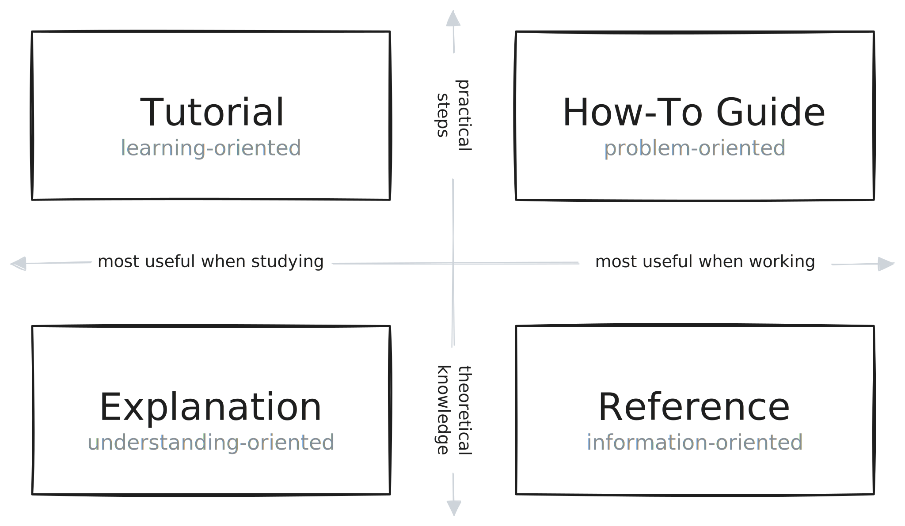

# Overview

### Tenzir is the data pipeline engine for security teams

If you need to collect, parse, shape, normalize, aggregate, store, query, and
route security telemetry data at scale, you'll love how our pipelines manage
your dataflows. Tenzir makes it easy to quickly onboard and store data from
numerous sources, reduce data volumes to optimize cloud and data costs, and
execute detections and run analytics in-stream.

Whether your architecture is a centralized **security data lake** or a
decentralized **security data fabric**—we got you covered.

  

    

      

        

          <h3>Ready to Dive in?</h3>
        

        

          

          Get your fingers dirty and explore the demo node with just a few
          clicks and a guided tour. Security data has never been easier.
          

        

        

          <a class="button button--primary button--block" href="quickstart">Quickstart</a>
        

      

    

    

      

        

          <h3>New to Tenzir?</h3>
        

        

          

            Learn the basics of pipelines and get familiar with the Tenzir
            Query Language (TQL). You'll master security data in no time.
          

        

        

          <a class="button button--primary button--block" href="pipelines">Pipelines</a>
        

      

    

  

## Documentation Types

Our documentation site consists of four different types of materials, each of
which addresses a specific user need.

- **How-To Guide**: Practical step-by-step explanation to help you achieve a
  specific goal. Most useful when you're trying to get something done.
- **Reference**: Nitty-gritty technical descriptions of how Tenzir works. Most
  useful when you need detailed information about Tenzir's building blocks.
- **Explanation**: Big-picture explanations of higher-level Tenzir concepts.
  Most useful for building understanding of a particular topic.
- **Tutorial**: Learning-oriented lesson that take you through a series of steps
  to complete a project. Most useful when you want to get started with Tenzir.

:::tip Need help?
We're here to help! If you have any questions, swing by our
friendly [community Discord](/discord) or open a [GitHub
discussion](https://github.com/tenzir/tenzir/discussions).
:::
