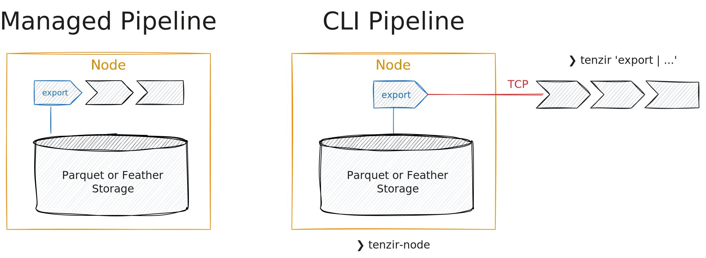

# Export from a node

Exporting (or *querying*) data can be done by [running a
pipeline](../run-pipelines/README.md) that begins with the
[`export`](../../operators/export.md) source. When managing a pipeline through
the app or the API, all pipeline operators run within the node. When using the
CLI, at least the `export` operator runs within the node.



Let's bring back the historical data we [imported in the previous
section](../import-into-a-node/README.md):

```
export | head
```

Think of `export` being the entire data at a node. As this can grow quickly, you
may query only subsets of it, e.g., by filtering it using
[`where`](../../operators/where.md):

```
export | where orig_bytes < 1 KiB
```

Logically, this query would *first* export the entire historical data, and
*then* begin filtering the data. But since Tenzir does *predicate pushdown*, the
pipeline executor will analyze the query and push the
[expression](../../language/expressions.md) in `where` with the predicate
`orig_bytes < 1 KiB` "down" to the `export` operator. Tenzir's storage engine
then asks its catalog to identify the relevant subset of partitions that the
query should execute on. This dramatically improves the query performance for
selective workloads, such as point queries for single values or specific time
ranges.

To figure out the shape of the data to query, you can [show available
schemas](../show-available-schemas.md).
