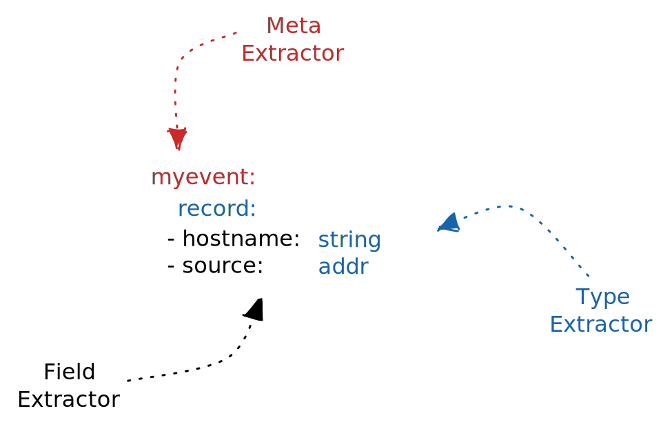

# Expressions

Tenzir's expression language makes it easy to describe a relevant subset of
interest over structured data. The "easy" part is that Tenzir expressions
operate on multiple different schemas at once, as opposed to traditional
expressions that apply to a single, fixed schema. The language captures this
heterogeneity with [extractors](#extractors).

:::tip Where?
Expressions occur in pipeline operators. The
[`where`](operators/where.md) operator is the most prominent
example.
:::

An *expression* is a function over an event that evaluates to `true` or
`false`, indicating whether it qualifies as result. Expression operands are
either sub-expressions or predicates, and can be composed via *conjunctions*
(`and`), *disjunctions* (`or`), and *negations* (`not`).

The following diagram shows an example expression in tree form:


When written out, it looks like this:

```c
(dport <= 1024 or :ip in 10.0.0.0/8) and not (#schema == /zeek.*/)
```

In this example, the predicate operands `dport`, `:ip`, and `#schema` represent
[extractors](#extractors) that resolve to a set of matching fields at runtime.

Let's take a look at the expression components in more depth.

## Connectives

There exist three logical connectives that connect sub-expressions:

- `and`: the logical AND between two expressions
- `or`: the logical OR between two expressions
- `not`: the logical NOT of one expression

## Predicates

A predicate has the form `LHS` `op` `RHS`, where `LHS` denotes the left-hand
side operand and `RHS` the right-hand side operand. The relational operator
`op` is [typed](#type-compatibility), i.e., only a subset of the cross product
of operand types is valid.

An operand is either an [extractor](#extractors) or a [value](#values). The
typing can often only inferred at runtime when schema information is available.

### Relational Operators

The following operators separate two operands:

- `<`: less than
- `<=`: less equal
- `>=`: greater equal
- `==`: equal to
- `!=`: not equal to
- `in`: in  *(left to right)*
- `!in`: not in *(left to right)*
- `ni`: in *(right to left)*
- `!ni`: not in *(right to left)*

### Type Compatibility

The table below illustrates a partial function over the cross product of
available types. Each letter in a cell denotes a set of operators:

- **E**: equality operators `==`, `!=`
- **R**: range operators `<`, `<=`, `>=`, `>`
- **M**: membership operators `in`, `!in`, `ni`, `!ni`

| | **Bool** | **Int64** | **UInt64** | **Double** | **Duration** | **Time** | **String** | **Pattern** | **IP** | **Subnet** | **Enum** | **List**
---|---|---|---|---|---|---|---|---|---|---|---|--
 **Bool** | E |  |  |  |  |  |  |  |  |  |  | M
 **Int64** |  | ER | ER | ER |  |  |  |  |  |  |  | M
 **UInt64** |  | ER | ER | ER |  |  |  |  |  |  |  | M
 **Double** |  | ER | ER | ER |  |  |  |  |  |  |  | M
 **Duration** |  |  |  |  | ER |  |  |  |  |  |  | M
 **Time** |  |  |  |  |  | ER |  |  |  |  |  | M
 **String** |  |  |  |  |  |  | EM | EM |  |  |  | M
 **Pattern** |  |  |  |  |  |  | EM | EM |  |  |  | M
 **IP** |  |  |  |  |  |  |  |  | E | EM |  | M
 **Subnet** |  |  |  |  |  |  |  |  | EM | EM |  | M
 **Enum** |  |  |  |  |  |  |  |  |  |  | E | M
 **List** | M | M | M | M | M | M | M | M | M | M | M | EM

### Extractors

An *extractor* retrieves a certain aspect of an event. When looking up an
expression, Tenzir *binds* the extractor to a specific record field, i.e., maps
it to the corresponding numeric column offset in the schema. **Binding an
expression implicitly creates a disjunction of all matching fields.** We find
that this existential qualification is the natural user experience when
"extracting" data declaratively.

Tenzir has the following extractor types:

1. [Field](#field-extractor): extracts all fields whose name match a given
   record field name.

2. [Type](#type-extractor): extracts all event types that have a field of a
   given type.

3. [Meta](#meta-extractor): extracts metadata describing the event instead of
   the actual values contained in it

The diagram below illustrate how extractors relate to each other:



#### Field Extractor

Field extractors have the form `x` or `x.y.z` where `x`, `y`, and `z` match on
record field names. The access fields in nested records. Using a type name as
leftmost element before a `.` is also possible.

A field extractor has *suffix* semantics. It is possible to just write `z` to
access `x.y.z`. In fact, writing `z` is equivalent to `*.z` and creates a
disjunction of all fields ending in `z`.

##### Examples

- `ts > 1 day ago`: events with a record field `ts` from the last 24h hours
- `zeek.conn.id.orig_h in 192.168.0.0/24`: connections with source IP in
  192.168.0.0/24
- `orig_bytes >= 10Ki`: events with a field `orig_bytes` greater or equal to
  10 * 2^10.

#### Type Extractor

Type extractors have the form `:T` where `T` is the type of a field. Type
extractors work for all [basic types](data-model/type-system.md) and
user-defined aliases.

A search for type `:T` includes all aliased types. For example, given the alias
`port` that maps to `uint64`, then the `:uint64` type extractor will also
consider instances of type `port`. However, a `:port` query does not include
`:uint64` types because an alias is a strict refinement of an existing type.

##### Examples

- `:timestamp > 1 hour ago`: events with a `timestamp` alias in the last hour
- `:ip == 6.6.6.6`: events with any field of type `ip` equal to 6.6.6.6
- `:uint64 > 42M`: events where `uint64` values is greater than 42M
- `"evil" in :string`: events where any `string` field contains the substring
  `evil`

#### Meta Extractor

Meta extractors have the form `#extractor`. They work on the event metadata
(e.g., their schema) instead of the value domain.

- `#schema`: the human-readable name of the schema
- `#schema_id`: the unique fingerprint for the schema
- `#import_time`: the ingestion time when event arrived at the server

##### Examples

- `#schema == "zeek.conn"`: events of type `zeek.conn`
- `"suricata" in #schema`: events that have `suricata` in their schema name
- `#import_time > 1 hour ago`: events that have been imported within the last
  hour

### Short Forms

There are three short forms for defining predicates succinctly. They are merely
syntactic sugar and can be used whenever a predicate is expected. The following
table shows how values, field extractors and type extractors are expanded.

| Short Form | Expansion        | Example
| ---------- | ---------------- | --------------------------------
| `value`    | `:type == value` | `"needle"` → `:string == "needle"`
| `field`    | `field != null`   | `header.req` → `header.req != null`
| `:type`    | `:type != null`   | `:ip` → `:ip != null`

The first form requires the event to contain a field with the given
value. This allows for quick type-based point queries, such as
`(6.6.6.6 || 10.0.0.0/8) && "evil"`. The second and third short forms
test for the existance of a field or type. They are useful to filter
out events with missing information.

:::tip
Values of type `subnet` expand more broadly. For example, the subnet
`10.0.0.0/8` expands to:

```c
:subnet == 10.0.0.0/8 or :ip in 10.0.0.0/8
```

This makes it easier to search for IP addresses belonging to a specific subnet.
:::

## Values

Every [type](data-model/type-system.md) has a corresponding value syntax in the
expression language.

| Literal    | Example
| ---------- | -------
| `none`     | `null`
| `bool`     | `true`, `false`
| `int64`    | `-42`, `+3`
| `uint64`   | `0`, `42`
| `double`   | `-0.7`, `1.337`
| `duration` | `-3us`, `24h`
| `time`     | `now`, `1h ago`, `2020-01-01+10:42:00`
| `string`   | `"foo"`
| `pattern`  | `/fo*.bar$/`, `/^\w{3}$/i`
| `ip`       | `::1`, `10.0.0.1`, `2001:db8::`
| `subnet`   | `::1/128`, `10.0.0.0/8`, `2001:db8::/32`
| `list`      | `[1, 2, 3]`, `[]`
| `record`    | `<x: a, y: b, z: c>`, `<a, b, c>`, `<>`
