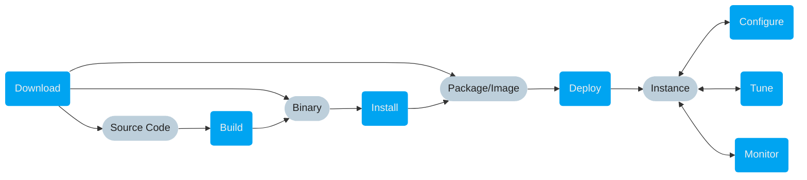

# Setup

This section describes Tenzir from an **operator perspective**. We cover the
different stages of the setup process to successfully run Tenzir. You have
several options to enter the setup process, based on what intermediate step
you would like to begin with.

