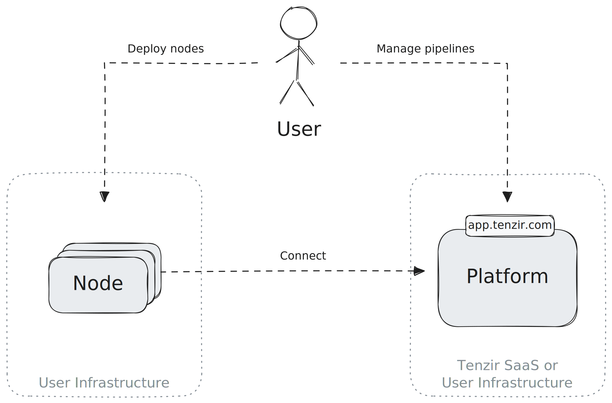

# How Tenzir Works

Tenzir is all about automating dataflows for a wide range of data processing
tasks, from cost optimization to building sophisticated security data
lakes. To this end, Tenzir features three primary components:

1. **Pipeline**: A sequence of operators responsible for loading, parsing,
  transforming, and routing data. Pipelines are the core mechanism for data
  processing.
2. **Node**: A running process that manages and executes pipelines.
3. **Platform**: A higher-level management layer that provides oversight and
  control over multiple nodes.

Let's dive deeper into each component.

## Executing Standalone and Managed Pipelines

You can run pipelines either standalone or managed. For **standalone
execution**, you run a single pipeline directly from the command line using the
`tenzir` binary:

This mode is ideal for ad-hoc data transformations akin to how one would use
`jq`, but with much broader data handling capabilities. For continuous and more
dependable dataflow processing, you will quickly realize that you also need
scheduled execution, automatic restarting, monitoring of warnings/errors, and
more advanced execution capabilities, like real-time enrichment with contextual
data or correlation with historical data. This is where **managed execution** of
pipelines in a node comes into play. You can spawn a node with the `tenzir-node`
binary or by running the Docker container that wraps the binary:

## Connecting Nodes to the Platform

When you deploy a node, it will automatically attempt to connect to the platform,
providing a seamless way to manage and deploy pipelines through the platform's
web interface. However, using the platform is optional—pipelines can still be
controlled directly via the node's API with a CRUD-style approach.

The platform, beyond pipeline management, offers user and workspace
administration, authentication support via external identity providers (IdP),
and persistent storage for dashboards. These dashboards can be customized with
charts, which are themselves powered by pipelines.

We host one instance of the platform at
[app.tenzir.com](https://app.tenzir.com), but you can also [deploy the platform
on premises](../installation/deploy-the-platform.md).

## Composing Pipelines into Use Cases

Pipelines can be combined to form larger, more complex data fabrics. One common
example is **split-routing**: sending actionable data to a SIEM while archiving
low-fidelity data in a cheaper storage solution.

Tenzir is the data pipeline toolkit that empowers you to quickly implement
data-heavy use cases without having to be a data engineer.

Now it's your turn to create something powerful!
