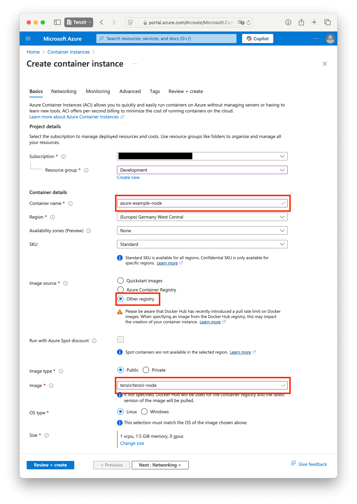
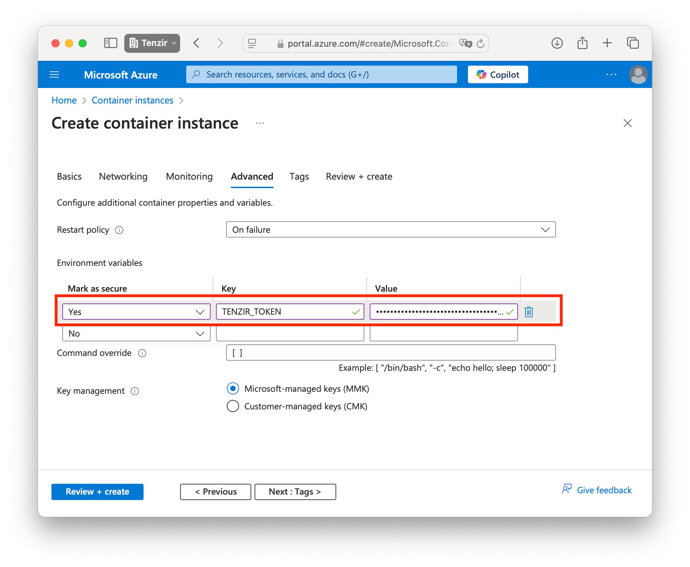

# Azure

To run a node in Azure, we recommend using [Azure Container Instances
(ACI)](https://azure.microsoft.com/en-us/products/container-instances), which
allows you to run Docker containers without having to setup VMs.

## Azure Container Instances (ACI)

Prior to getting started, you need a valid `TENZIR_TOKEN` that you can obtain
after [provisioning a node](../README.md) and downloading the Docker Compose
configuraiton file.

### Create a new container instance

1. Open https://portal.azure.com/.
1. Navigate to the *Container instances*.
1. Click the *Create* button.

### Basics

In the *Basics* tab, perform the following action:

1. Choose a container name.
1. For *Image source*, select *Other registry*.
1. For *Image*, enter `tenzir/tenzir-node`.

### Networking

In the *Networking* tab, configure the ports you plan to use for pipeliens that
receive incoming connections.

### Advanced

In the *Advanced* tab, enter the `TENZIR_TOKEN` environment variable from your
Docker Compose file.

### Create

Once you've completed the configuration, click the *Create* button. Your node is
now up and running.
